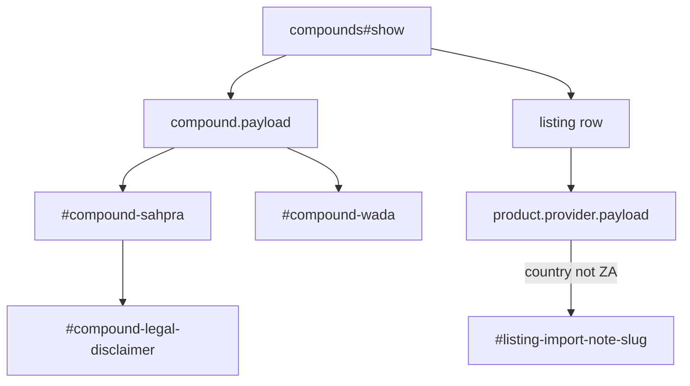

# Legal and athlete flags - Plan

## Goal Capsule

- **Objective:** Show SAHPRA and WADA facts on each compound page, with SAIDS named and no legal-to-buy mark.
- **Authority:** `docs/PRD.md` F-7 and F-10, then `docs/EPICS.md` EP-04, then GitHub `#7` `#9` `#10` `#11` `#13` `#15` `#18` `#21`.
- **In scope:** Compound detail flags, nested review dates, import-rule sentence on non-SA listings, locale strings, tests.
- **Out of scope:** Search, filters, comparison table, COA UI, stack WADA rollup, a compete-this-weekend wizard.
- **Stop when:** Starter compounds that SAHPRA named in 2026 show that flag. BPC-157 shows WADA S0. TB-500 shows S2.3. Disclaimer stays visible. No traffic-light legal badge.
- **Execution profile:** Standard Rails UI on existing payload JSON. Do not add a second legal schema.

---

## Product Contract

### Summary

Phase 1 already stores `sahpra` and `wada` on each compound file and copies the whole file into `compounds.payload`. Visitors still cannot see those facts on the page. This plan renders them high on the compound page, repeats that the site is not legal advice, names SAIDS, and states the prior-authorisation rule only on listings from non-SA shippers.

### Problem Frame

A tested athlete in South Africa who misses a WADA flag can be banned. The May 2026 SAHPRA peptide warning is the local context. A green "legal to buy" badge would be a lie. Intended use matters under the Medicines Act, and this catalog must not pretend to licence a purchase.

### Requirements

**SAHPRA (F-7, `#9` `#10` `#11`)**

- R1. The compound page shows registered as yes, no, or unknown from `payload.sahpra.registered_medicine` (`true` / `false` / `null`).
- R2. The same block lists registration numbers when present, and schedule when present. Blank schedule is allowed.
- R3. Compounds with `on_unregistered_warning_list: true` show that they are on the May 2026 unregistered peptide warning, with dated notes and a link to `https://www.sahpra.org.za/peptide-products-public-information/`.
- R4. The flags block repeats "this is not legal advice" in addition to the site-wide disclaimer.

**Import rule (`#13`)**

- R5. On a listing whose provider `country` is not `ZA`, show that prior SAHPRA authorisation is the stated rule for personal import of unregistered medicines. Do not frame that sentence as permission.

**WADA / SAIDS (F-10, `#15` `#18`)**

- R6. The compound page shows the WADA flag, class, list year, one-line note, and official list link high on the page (above the summary).
- R7. The WADA block names SAIDS as the local code signatory.

**Dates (`#21`)**

- R8. SAHPRA uses `sahpra.verified_on`. WADA uses `wada.verified_on`. Those dates may differ from the compound `last_reviewed_at`.

### Actors

- A1. Visitor reading a compound page (no account).
- A2. Tested athlete who needs the WADA fact before anything else on the page.

### Key Flows

- F1. Open `/compounds/bpc-157`
  - **Outcome:** After the site disclaimer and the title, WADA S0 and the SAHPRA warning sit before the research summary. Legal-advice line sits with the flags. Flags stay compact so they are not buried under extra chrome.
- F2. Open a listing whose provider country is not ZA
  - **Outcome:** Prior-authorisation sentence is on that listing row. ZA listings do not show it.
- F3. Open `/compounds/ghk-cu` (not named on the peptide warning, not named by WADA)
  - **Outcome:** Registered unknown or no. Warning flag is off. WADA shows not prohibited, with the official link still present.

### Acceptance Examples

- AE1. Covers R3, R6. Given BPC-157 JSON, when the detail page loads, then `#compound-sahpra-warning` is present and `#compound-wada` contains S0 and the 2026 list link.
- AE2. Covers R5. Given a listing whose provider `country` is not `ZA`, when the compound listings render, then that row includes `#listing-import-note-<slug>` with the prior-authorisation wording and without the word permission as a grant.
- AE3. Covers R4, R7. Given any compound page, then `#compound-legal-disclaimer` and `#compound-saids` are present, and `#catalog-disclaimer` remains.

### Scope Boundaries

- **In:** Compound show. Listing-row import note. Locale keys. Helper for yes/no/unknown.
- **Deferred for later:** Last-checked chrome for every record (EP-05 `#30` `#31`). Stack WADA rollup (EP-08).
- **Outside this product's identity:** Legal advice. Traffic-light "legal to buy". A wizard that answers "can I compete this weekend?".

---

## Planning Contract

### Key Technical Decisions

- KTD1. **Read nested facts from `payload`.** `Catalog::Importer` already stores the full compound JSON in `compounds.payload`. Do not add `sahpra_*` columns. Rationale: Phase 1 chose payload-as-document so legal keys can change without a migration.
- KTD2. **Use existing `verified_on` dates.** The JSON schema already requires `sahpra.verified_on` and `wada.verified_on`. Do not add a second nested `last_reviewed_at`. Map PRD wording "legal blocks may carry their own review date" onto those fields.
- KTD3. **WADA sits above the summary.** Place `#compound-wada` then `#compound-sahpra` then `#compound-legal-disclaimer` immediately under the title line, before "What it is". Athletes must see the flag without reading the research summary first.
- KTD4. **Non-SA means provider `country` other than `ZA`.** Read `provider.payload["country"]` (already imported). Do not infer from website TLD.
- KTD5. **No colour traffic light.** Use text and a plain border. Do not use green/amber/red for registered, warning, or prohibited.
- KTD6. **Strings stay in `config/locales/en.yml`.** Controllers and views do not contain English sentences.

### Assumptions

- Starter JSON already has honest SAHPRA and WADA values from Phase 1. This plan does not re-research compounds.
- `wada: null` is allowed by schema. Render "WADA status is not on file" rather than inventing `prohibited: false`.
- Official WADA link is `https://www.wada-ama.org/en/prohibited-list`. SAIDS is named in copy; do not invent a SAIDS API.

### High-Level Technical Design

Page order on `app/views/compounds/show.html.erb`: disclaimer partial, title, WADA, SAHPRA, legal-advice line, then existing summary and listings. Listings gain an optional import note.

### Sequencing

U1 locale and helpers, then U2 compound flags, then U3 import note on listings, then U4 tests.

---

## Implementation Units

### U1. Locale keys and legal helpers

- **Goal:** Name every visible legal string and add helpers that map stored values to labels.
- **Requirements:** R1, R2, R6, R7, R8
- **Dependencies:** none
- **Files:**
  - modify: `config/locales/en.yml`
  - modify: `app/helpers/application_helper.rb`
  - create: `test/helpers/application_helper_test.rb`
- **Approach:** Add `compounds.sahpra_*`, `compounds.wada_*`, `compounds.legal_disclaimer`, `compounds.saids`, `compounds.import_rule` keys. Helper `registered_medicine_label(value)` maps `true`/`false`/`nil` to Yes / No / Unknown. Helper `payload_date(hash, key)` reads `verified_on`. Do not colour-code.
- **Patterns to follow:** `evidence_grade_label` and `provider_kind_label` in `app/helpers/application_helper.rb`.
- **Test scenarios:**
  - Happy path: `registered_medicine_label(true)` returns the Yes locale string.
  - Edge: `nil` returns Unknown.
  - Edge: `false` returns No.
  - `non_sa_shipper?` is true for country `US`, false for `ZA`, false when country is missing.
- **Verification:** Helper tests pass. No English literals in the helper.

### U2. Render SAHPRA and WADA high on compound detail

- **Goal:** Athletes see WADA and SAHPRA facts above the summary, with SAIDS and the legal-advice line.
- **Requirements:** R1, R2, R3, R4, R6, R7, R8
- **Dependencies:** U1
- **Files:**
  - modify: `app/views/compounds/show.html.erb`
  - create: `app/views/compounds/_legal_flags.html.erb`
  - modify: `test/integration/catalog_browse_test.rb`
- **Approach:** Partial `compounds/legal_flags` reads `@compound.payload`. Use `h2` headings for WADA and SAHPRA. Stable ids: `#compound-wada`, `#compound-wada-prohibited`, `#compound-wada-class`, `#compound-wada-year`, `#compound-wada-note`, `#compound-wada-link`, `#compound-saids`, `#compound-sahpra`, `#compound-sahpra-registered`, `#compound-sahpra-registration-numbers`, `#compound-sahpra-schedule`, `#compound-sahpra-notes`, `#compound-sahpra-warning`, `#compound-sahpra-link`, `#compound-legal-disclaimer`. `#compound-wada-prohibited` is required when `wada` is present: locale for prohibited vs not prohibited from `wada.prohibited`. Omit `#compound-sahpra-registration-numbers` when the array is empty. Omit `#compound-sahpra-schedule` when schedule is null. Render `#compound-sahpra-notes` when `sahpra.notes` is present. When `wada` is null, `#compound-wada-empty` states that status is not on file and still shows the official list link. Warning element is present only when `on_unregistered_warning_list` is true. Dates render as `Checked YYYY-MM-DD` from `verified_on`. Keep the flags compact (one short WADA line plus one SAHPRA line before details) so they stay near the title under the site disclaimer.
- **Execution note:** Start with a failing integration assertion on `#compound-wada` for `bpc-157`.
- **Patterns to follow:** Existing `#compound-summary` and `#catalog-disclaimer` on the same page.
- **Test scenarios:**
  - Covers AE1. GET `/compounds/bpc-157` includes `#compound-wada-prohibited` (prohibited), WADA S0, `#compound-sahpra-warning`, `#compound-sahpra-notes`, and the SAHPRA public link.
  - Covers AE3. Same page includes `#compound-legal-disclaimer`, `#compound-saids`, and `#catalog-disclaimer`.
  - GET `/compounds/tb-500` includes WADA S2.3.
  - GET `/compounds/ghk-cu` does not include `#compound-sahpra-warning`. `#compound-wada-prohibited` is the not-prohibited locale string.
  - After import, set one compound payload `wada` to null in the integration test (do not add a fake public compound file). That page shows `#compound-wada-empty` rather than crashing.
  - After import, temporarily set `sahpra.registration_numbers` and `sahpra.schedule` on one payload. Assert `#compound-sahpra-registration-numbers` and `#compound-sahpra-schedule`. Starter files are empty/null, so do not rely on live JSON for those two ids.
- **Verification:** Integration tests green. Disclaimer remains first in the document.

### U3. Prior-authorisation note on non-SA listings

- **Goal:** Non-SA shippers carry the import rule. ZA listings do not.
- **Requirements:** R5
- **Dependencies:** U1
- **Files:**
  - modify: `app/views/compounds/show.html.erb`
  - modify: `app/helpers/application_helper.rb`
  - modify: `test/integration/catalog_browse_test.rb`
- **Approach:** Helper `non_sa_shipper?(provider)` is true when `provider.payload["country"]` is present and not `ZA` (case-insensitive). Render `#listing-import-note-<slug>` inside the existing listing `<li>`. Copy must say prior SAHPRA authorisation is the stated rule. Copy must not say the catalog permits import.
- **Patterns to follow:** Research-storefront notice on `app/views/providers/show.html.erb`.
- **Test scenarios:**
  - Covers AE2. A fixture or live listing with `country` other than ZA shows the note.
  - A ZA listing (Reschem) does not show the note.
  - Missing country does not show the note (unknown is not treated as foreign).
- **Verification:** Integration tests distinguish ZA vs non-ZA rows.

### U4. Playwright coverage for the compound flag page

- **Goal:** First user-facing Phase 2 flow has an id-only browser spec.
- **Requirements:** R3, R4, R6, R7
- **Dependencies:** U2
- **Files:**
  - create: `package.json` (Playwright as a dev dependency; no other frontend stack)
  - create: `e2e/playwright.config.ts`
  - create: `e2e/compound-legal-flags.spec.ts`
- **Approach:** This plan is the first Playwright scaffold. Later Phase 2 plans reuse it. Config `webServer` boots `bin/rails server` (test or development with catalog already imported). `baseURL` is `http://127.0.0.1:3000`. Specs select `#compound-wada`, `#compound-wada-prohibited`, `#compound-sahpra`, `#compound-legal-disclaimer`, `#compound-saids` by id. Do not assert on CSS structure or full paragraph text. Document in README that agents run `npx playwright test` after `bin/rails catalog:import`. Do not add Playwright to `bin/ci` in this plan (`bin/ci` stays Minitest + `catalog:check`). Later CI wiring is follow-up.
- **Patterns to follow:** AGENTS.md stable DOM id rule. README already names `e2e/` as the home for Playwright.
- **Test scenarios:**
  - Visit `/compounds/bpc-157`. The four ids above exist.
  - Visit `/compounds/bpc-157`. `#catalog-disclaimer` still exists.
- **Verification:** `npx playwright test` covers this flow. Minitest suite still green.

---

## Verification Contract

| Gate | Command | Proves |
| --- | --- | --- |
| Locale and helpers | `bin/rails test test/helpers/application_helper_test.rb` | Yes/No/Unknown and non-SA helper |
| Compound page | `bin/rails test test/integration/catalog_browse_test.rb` | Flags, SAIDS, disclaimer, import note |
| Full suite | `bin/rails test` | No regression on Phase 1 browse |
| Lint | `bin/rubocop` | Style |
| Browser | `npx playwright test` | Flag ids on a live page |

---

## Definition of Done

- `#7` stories `#9` `#10` `#11` `#13` `#15` `#18` `#21` are each covered by a unit above.
- BPC-157 shows SAHPRA warning and WADA S0. TB-500 shows WADA S2.3.
- No green/amber/red legal badge. No "legal to buy". No compete wizard.
- English strings live in `config/locales/en.yml`.
- Site-wide disclaimer remains above the flags.
- Abandoned experimental partials are not left in the diff.

---

## Risks and Dependencies

- **Schema vs PRD wording:** PRD says nested `last_reviewed_at`; files use `verified_on`. This plan follows the files. EP-05 stamps will reuse the same dates.
- **No live non-SA provider in the first drop:** If every starter provider is `ZA`, U3 still ships the helper and a test with a temporary record. Do not add a fake public provider to `data/`.
- **Depends on:** Phase 1 compound pages (`app/views/compounds/show.html.erb`) and stored payload.
