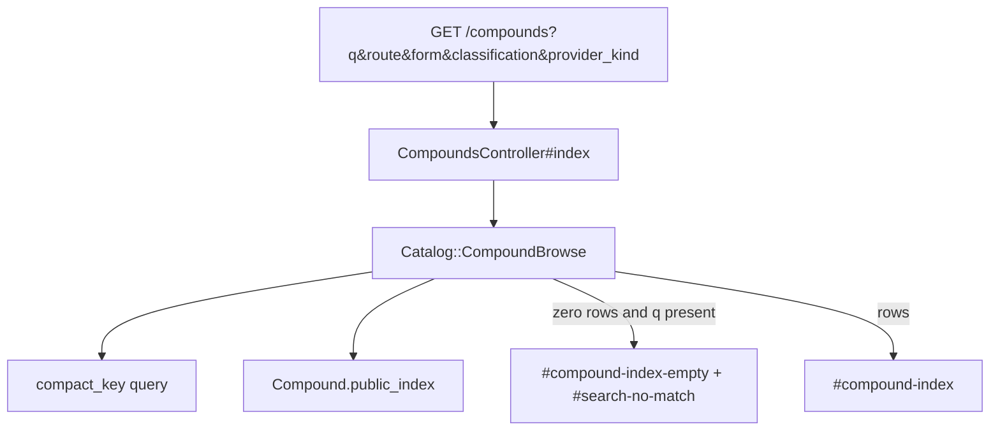

# Search, browse, and last-verified stamps - Plan

## Goal Capsule

- **Objective:** Visitors can filter the catalog, reach a compound by alias or misspelling, and see when each fact was checked.
- **Authority:** `docs/PRD.md` F-5, F-6, F-12, F-13 (class chips), then `docs/EPICS.md` EP-05, then GitHub `#6` `#17` `#20` `#23` `#24` `#28` `#30` `#31` `#33`.
- **In scope:** Filter chips, alias search, empty-result report path, Checked dates, 90-day needs-review, brand vs research name.
- **Out of scope:** Live vendor scrape. Fuzzy guess of a nearby compound. Offline cache (EP-06). Evidence-grade card stamp (`#49`). Comparison table (`#37`).
- **Stop when:** `BPC157`, `bpc 157`, and a known brand reach the compound. Unknown input does not invent a row. Dates show. Facts older than 90 days show needs review.
- **Execution profile:** GET filters and a query object. No JavaScript required for the happy path.

---

## Product Contract

### Summary

Phase 1 pages list every compound and provider. There is no search box, no chip filter, and no visible review date. This plan adds shareable GET filters, compact-key alias search, an honest empty state with a report path, and Checked stamps.

### Problem Frame

Without filters the catalog is a wall of pages. Without alias search a first visit looks empty. Without dates, prices and legal flags become folklore.

### Requirements

**Browse (F-5, F-13, `#17` `#20` `#23`)**

- R1. Visitors filter compounds by route, form, class, and provider type.
- R2. The injectable chip covers both stored injection routes (`injectable_subq` and `injectable_im`).
- R3. Empty results state that the result is empty. They do not show a guessed nearby compound.
- R4. Default sort is not cheapest first. Name order is the default. Provider type may later prefer compounding pharmacy over unknown. Copy must not say "safe".

**Search (F-6, `#24` `#28` `#33`)**

- R5. Search matches alias, brand, and common spacing or hyphen variants after normalising hyphens, spaces, and case.
- R6. An unknown string returns no match plus a way to report a missing alias. Search never invents a compound.
- R7. When a stored `inn` or brand alias is used, the compound page labels brand name vs research name.

**Stamps (F-12, `#30` `#31`)**

- R8. Compounds, providers, listings, and legal blocks show `Checked YYYY-MM-DD`.
- R9. A fact whose date is older than 90 days shows "needs review". The UI is not a live scrape clock.

### Actors

- A1. Visitor typing a nickname or brand.
- A2. Visitor narrowing the index by route or provider type.

### Key Flows

- F1. Type `BPC157` or `bpc 157` in the catalog search
  - **Outcome:** The BPC-157 compound is the result. URL keeps the query.
- F2. Choose injectable plus compounding pharmacy
  - **Outcome:** Only matching compounds remain. Injectable includes subq and IM listings.
- F3. Type `xyzzy-not-a-peptide`
  - **Outcome:** `#search-no-match` and `#search-report-alias` are present. No compound card is invented.
- F4. Open a compound whose `last_reviewed_at` is 91 days ago
  - **Outcome:** `#compound-needs-review` is present.

### Acceptance Examples

- AE1. Covers R5. Given aliases on `bpc-157.json`, when `q=BPC157` or `q=bpc 157` or `q=bepecin`, then the index shows BPC-157. Do not redirect.
- AE2. Covers R6. Given `q=xyzzy-not-a-peptide`, then no `#compound-card-*` is rendered and `#search-report-alias` exists.
- AE3. Covers R2. Given a compound listed only as `injectable_subq`, when `route=injectable`, then that compound remains.
- AE4. Covers R9. Given `last_reviewed_at` 91 days before today, then needs-review is visible.

### Scope Boundaries

- **In:** Compound index search and chips. Checked stamps on compound, provider, listing, and legal blocks. Brand/INN label on compound show.
- **Deferred:** Provider index chips can wait if compound browse already filters by provider type through listings. Do not build a second search engine for providers in this plan unless the compound filter cannot express provider type.
- **Outside this product's identity:** Fuzzy Levenshtein guess. User accounts. A public forum for alias reports.

---

## Planning Contract

### Key Technical Decisions

- KTD1. **Query object in `lib/catalog`, not a fat controller.** `Catalog::CompoundBrowse` lives at `lib/catalog/compound_browse.rb` next to `Importer` and `Validator`. Do not add `app/queries`. Controller permits only `q`, `route`, `form`, `classification`, `provider_kind` and assigns `@compounds = Catalog::CompoundBrowse.new(permitted).records`. `.records` returns an ActiveRecord relation ordered by name, or an empty relation. Follow layered Rails: no SQL in the view.
- KTD2. **Compact-key equality, not fuzzy match and not substring.** Compact both the query and each candidate (name, slug, each alias, inn) by lowercasing and stripping hyphens, spaces, and underscores. Match only on equality of those compact strings. `bpc157` equals `BPC-157` equals `bpc 157`. Do not use trigram, Levenshtein, or `ILIKE '%q%'`. Unknown strings stay unknown.
- KTD3. **Shareable GET.** Search is a GET form to `compounds_path`. Chips are links that preserve other params. No Stimulus is required. Turbo Drive is enough.
- KTD4. **Single-result search stays on the index.** Do not auto-redirect to the compound show page. A list of one is honest. Redirect would hide that other aliases might also match later.
- KTD5. **Report path is a GitHub issue link plus mailto.** `#search-report-alias` opens a prefilled GitHub new-issue URL for `davidteren/peptides_research_south_africa` (title `Missing alias: <query>`). Also offer `mailto:` if a curator address is already in the repo. Do not add a form that writes to the database.
- KTD6. **90 days is calendar days from the stamp date to `Date.current`.** Helper `needs_review?(date)` is true when date is present and `date < Date.current - 90`. Do not use a JavaScript clock.
- KTD7. **Legal-block stamps reuse `verified_on`.** Compound/provider/product use `last_reviewed_at`. SAHPRA/WADA use `verified_on` from the EP-04 flags partial. This plan adds the visible stamp; it does not invent a second date field.
- KTD8. **Default sort is `compounds.name`.** Never `price_zar`. If a type preference is added, rank `compounding_pharmacy` and `clinic` above `unknown` only when sorting providers, not as a "safe" label.

### Assumptions

- Alias lists on the six starter compounds already include compact forms (`BPC157`, `BPC 157`). Browse must still normalise so a new alias without both forms still hits.
- No starter compound is a registered SAHPRA medicine with an INN brand (Ozempic example in the PRD). R7 still ships: when `inn` is present, show it labelled. When a search query equals a stored alias and `inn` is present, label brand vs research name.
- EP-04 flags partial may land first. If it has not, Checked dates for legal blocks wait on that partial and this plan still stamps compound, provider, and listing.

### High-Level Technical Design

Injectable mapping: `params[:route] == "injectable"` matches product or `routes_studied` in `injectable_subq` / `injectable_im`. Other route chips map 1:1 to the enum.

### Sequencing

U1 browse query object, U2 search box and chips, U3 empty report path, U4 stamps and INN label, U5 tests.

---

## Implementation Units

### U1. Compound browse query object

- **Goal:** Filter and search compounds without SQL in the controller or view.
- **Requirements:** R1, R2, R4, R5
- **Dependencies:** none
- **Files:**
  - create: `lib/catalog/compound_browse.rb`
  - create: `test/models/catalog_compound_browse_test.rb`
  - modify: `app/controllers/compounds_controller.rb`
- **Approach:** Scope starts at `Compound.public_index`. Apply chip filters in ActiveRecord where cheap (`classification` on the column; form and `provider_kind` via product/provider joins). Apply compact-key equality in Ruby on `name`, `slug`, `payload.aliases`, and `payload.inn`, then return those rows as a name-ordered relation (`where(id: matched_ids).order(:name)`). Route filter: `injectable` expands to both injection enums; other values match `payload.routes_studied` or associated `products.route`. Do not order by price. For AE3, build a minimal in-test compound whose only `routes_studied` value is `injectable_subq` (live BPC-157 files also match injectable through product rows; keep both paths explicit).
- **Execution note:** Write the query tests first with imported catalog data plus one compact-key case.
- **Patterns to follow:** `Compound.public_index` in `app/models/compound.rb`. Keep ActiveRecord in the query object, not in helpers.
- **Test scenarios:**
  - Covers AE1. `q: "BPC157"` and `q: "bpc 157"` both return BPC-157.
  - `q: "bepecin"` returns BPC-157 (stored alias).
  - Compact-key substring that is not a stored alias (`q: "bpc"`) returns none.
  - Covers AE3. `route: "injectable"` includes a compound whose only stored route is `injectable_subq`.
  - `q: "xyzzy-not-a-peptide"` returns none.
  - Result relation is ordered by name, not price.
  - Rumour compounds stay out.
- **Verification:** Query tests pass without hitting a view.

### U2. Search box and filter chips on the compound index

- **Goal:** Visitors can type a query and click chips. The URL is the state.
- **Requirements:** R1, R2, R3, R4, R5
- **Dependencies:** U1
- **Files:**
  - modify: `app/views/compounds/index.html.erb`
  - create: `app/views/compounds/_browse_controls.html.erb`
  - modify: `config/locales/en.yml`
  - modify: `app/views/layouts/application.html.erb` only if a small search field in the header is needed to meet F-6; prefer the index form first
- **Approach:** GET form `#compound-search` with labelled input `#compound-search-q` (`label for=` or `aria-label`) and submit `#compound-search-submit`. Chip groups `#filter-route`, `#filter-form`, `#filter-classification`, `#filter-provider-kind` are `fieldset`/`legend` (or have `aria-label`). Each chip is a link with id `filter-route-injectable` and similar. Selected chip uses `aria-current="true"` (chips are navigation links, not toggle buttons). Three empty states: no records and no params → `#compound-index-empty` ("No compounds are in the catalog yet."); `q` present and zero rows → `#search-no-match` (U3); chips present, `q` blank, zero rows → `#filter-no-match` with copy that the filters matched nothing, never that the catalog is empty.
- **Patterns to follow:** Existing `#compound-index` list. Semantic HTML. Tailwind utilities already on the index.
- **Test scenarios:**
  - GET `/compounds` without params lists the six starter compounds.
  - GET `/compounds?q=bpc+157` includes `#compound-card-bpc-157`.
  - GET `/compounds?route=injectable` does not 500 and uses the query object.
  - Default page has no price sort control.
- **Verification:** Integration test covers ids. RuboCop clean.

### U3. Unknown query empty state and alias report path

- **Goal:** Unknown input is empty and reportable, never invented.
- **Requirements:** R6
- **Dependencies:** U2
- **Files:**
  - modify: `app/views/compounds/index.html.erb`
  - modify: `config/locales/en.yml`
  - modify: `test/integration/catalog_browse_test.rb`
- **Approach:** When `q` is present and records are none, render `#search-no-match` and `#search-report-alias`. The report link is an external GitHub new-issue URL with the query in the title. Do not create an Alias model. Do not suggest the nearest compound name.
- **Patterns to follow:** Honest empty copy already used for `#compound-index-empty`.
- **Test scenarios:**
  - Covers AE2. Unknown `q` shows `#search-no-match` and `#search-report-alias`, zero `data-testid=compound-card`.
  - Known `q` does not show the report block.
- **Verification:** Integration assertion on ids only.

### U4. Checked stamps, needs-review, and INN label

- **Goal:** Readers see when a fact was checked, and brand vs research names stay distinct.
- **Requirements:** R7, R8, R9
- **Dependencies:** U1
- **Files:**
  - modify: `app/helpers/application_helper.rb`
  - modify: `app/views/compounds/show.html.erb`
  - modify: `app/views/compounds/index.html.erb`
  - modify: `app/views/providers/show.html.erb`
  - modify: `app/views/providers/index.html.erb`
  - modify: `app/views/compounds/_legal_flags.html.erb` (if EP-04 landed) or the flags section
  - modify: `config/locales/en.yml`
  - modify: `test/helpers/application_helper_test.rb`
- **Approach:** Helper `checked_stamp(date, id:)` renders `Checked YYYY-MM-DD` and, when `needs_review?(date)`, a sibling needs-review element. Pin ids: `#compound-checked`, `#compound-needs-review`, `#provider-checked`, `#provider-needs-review`, `#listing-checked-<slug>`, `#listing-needs-review-<slug>`, `#compound-sahpra-checked`, `#compound-wada-checked`. On compound show, if `payload["inn"]` is present, `#compound-inn` labels it as the research/INN name vs aliases as brand or other names. Noopept (`inn` omberacetam) is the live example. Do not mark a date "live".
- **Patterns to follow:** Evidence grade label helper. Legal flags plan KTD2 for `verified_on`.
- **Test scenarios:**
  - Covers AE4. Helper with a 91-day-old date marks needs review. A today date does not.
  - Compound show includes `#compound-checked`.
  - Provider show includes `#provider-checked`.
  - Compound with `inn` shows `#compound-inn`. Compound with null `inn` does not invent a brand.
- **Verification:** Helper tests plus integration selectors.

### U5. Playwright for search, empty, and chips

- **Goal:** Browser proof of F-5 and F-6 using ids only.
- **Requirements:** R1, R5, R6
- **Dependencies:** U2, U3
- **Files:**
  - create: `e2e/compound-browse.spec.ts`
- **Approach:** Fill `#compound-search-q` with `BPC157`, submit `#compound-search`, assert `#compound-card-bpc-157`. Repeat for unknown query asserting `#search-no-match`. Click `#filter-route-injectable`.
- **Patterns to follow:** EP-04 Playwright unit if it already added `e2e/`. Ids only.
- **Test scenarios:**
  - Known alias search shows the BPC-157 card.
  - Unknown search shows no-match and report link.
  - Injectable chip keeps the page on `/compounds`.
- **Verification:** `npx playwright test`. Full `bin/rails test` green.

---

## Verification Contract

| Gate | Command | Proves |
| --- | --- | --- |
| Query object | `bin/rails test test/models/catalog_compound_browse_test.rb` | Compact-key search and injectable mapping |
| Browse pages | `bin/rails test test/integration/catalog_browse_test.rb` | Chips, empty report, stamps |
| Helpers | `bin/rails test test/helpers/application_helper_test.rb` | 90-day rule |
| Full suite | `bin/rails test` | Phase 1 still works with extra params |
| Lint | `bin/rubocop` | Style |
| Browser | `npx playwright test` | Search and empty path |

---

## Definition of Done

- `#6` stories `#17` `#20` `#23` `#24` `#28` `#30` `#31` `#33` are covered.
- `BPC157` and `bpc 157` reach BPC-157. Unknown strings invent nothing.
- Default sort is name. Copy never says "safe" as a ranking claim.
- Checked dates show. Dates older than 90 days show needs review.
- English strings stay in locale files.
- No new database table for aliases or reports.

---

## Risks and Dependencies

- **Filter by form and provider type needs product joins.** A compound with no listings will disappear when those chips are on. Empty state must explain that, not look like a site failure.
- **EP-04 landing order.** Legal-block stamps attach to the flags partial. If EP-04 is not merged, ship compound/provider/listing stamps first and leave a deferred note on legal-block stamps.
- **Depends on:** Phase 1 indexes, payload aliases, `last_reviewed_at` already required by `Catalog::Validator`.
