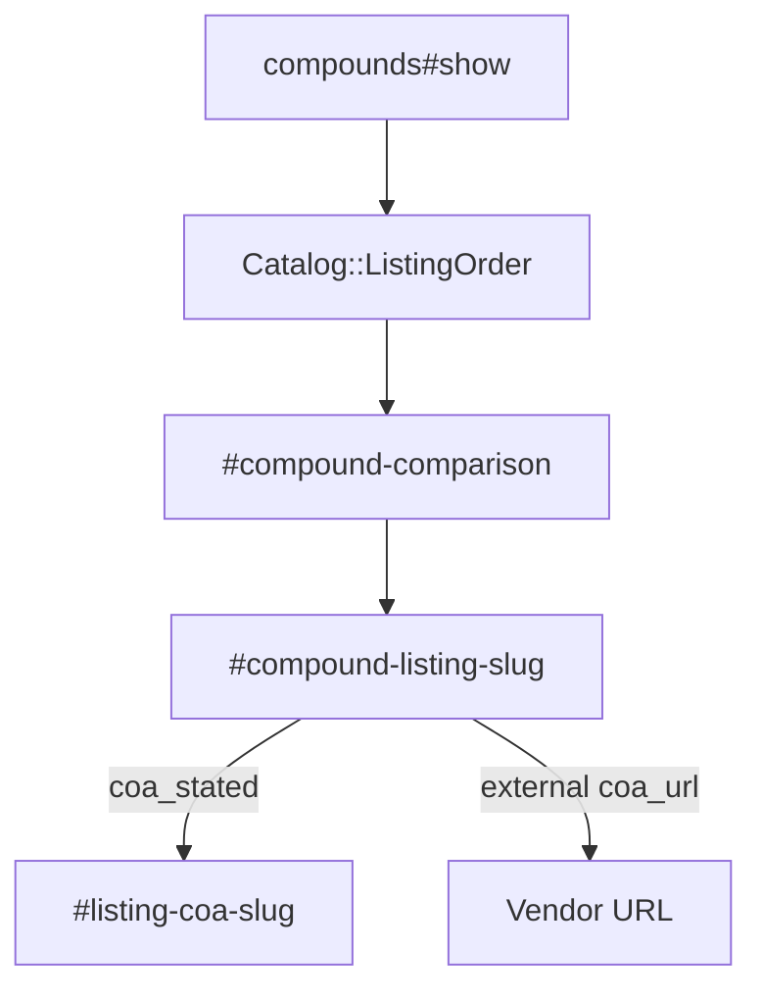

# Comparison table and COA-stated flag - Plan

## Goal Capsule

- **Objective:** Compare listings by form, route, rand as-of, origin, and cold-chain, and show "provider states a COA" without hosting files.
- **Authority:** `docs/PRD.md` F-9 and F-11, `docs/EPICS.md` EP-03 Phase 2 stories, GitHub `#37` and `#39`.
- **In scope:** Comparison table on the compound page, COA-stated copy with vendor URL and date, sort that is not cheapest-first.
- **Out of scope:** Buy button. WhatsApp order. Live stock. Purity score. Hosted PDFs. Filter chips (EP-05).
- **Stop when:** The table shows form, route, rand as-of, ships-from (ZA vs abroad), and cold-chain. COA copy is a stated flag only.
- **Execution profile:** Expand the existing listings list into a table. Read provider and product payload. No new models.

---

## Product Contract

### Summary

Phase 1 already prints listing rows (provider, form, strength, optional rand). Phase 2 needs a real comparison: origin and cold-chain, a dated price, and a COA-stated flag. Default sort must not rank unknown storefronts as if they were pharmacies.

### Problem Frame

Type on the provider page is not enough. Readers need a side-by-side of form, origin, and price date. A shop-style cheapest-first sort would rank unknown storefronts as if they were a pharmacy. Hosting a COA PDF would look like a purity proof this catalog does not give.

### Requirements

**Comparison (`#37`, F-9)**

- R1. Comparison table shows form, route, rand as-of (`price_zar` + `price_checked_on`), ships-from (ZA vs abroad, coarse region if known), and cold-chain.
- R2. There is no buy button and no WhatsApp order control.
- R3. Default sort is not cheapest first. It may prefer `compounding_pharmacy` / `clinic` over `unknown`. It must not say "safe".
- R4. Provider type remains a classification, not a recommended or verified badge.

**COA (`#39`, F-11)**

- R5. When `coa_stated` is true, show "provider states a COA" with the vendor `coa_url` and `coa_checked_on`.
- R6. Do not host PDFs. Do not say tested safe. Do not score purity.

### Actors

- A1. Visitor comparing one compound across local listings.

### Key Flows

- F1. Open `/compounds/bpc-157` listings
  - **Outcome:** A table `#compound-comparison` lists each product with the F-9 columns. No Buy control.
- F2. Open a listing with `coa_stated: true`
  - **Outcome:** That row includes `#listing-coa-<slug>` with the stated-flag copy and an external URL.
- F3. Open a listing with `coa_stated: false`
  - **Outcome:** No COA claimed. Row still compares form and price date.

### Acceptance Examples

- AE1. Covers R1, R2. Given BPC-157 listings, the comparison table has columns for form, route, rand as-of, ships-from, cold-chain, and has no `#buy-*` control.
- AE2. Covers R3. Table order is not ascending `price_zar`.
- AE3. Covers R5, R6. A `coa_stated: true` row links off-site and uses the stated-flag locale string, not "tested safe".

### Scope Boundaries

- **In:** Compound show listings. Optional same table treatment on provider show listings if the markup is a shared partial.
- **Deferred:** Filter chips by provider type (EP-05). Import-rule sentence (EP-04 U3) may share the row; this plan does not duplicate it.
- **Outside this product's identity:** Checkout. Affiliate ranking. Hosted COA files. "Recommended seller".

---

## Planning Contract

### Key Technical Decisions

- KTD1. **One table on the compound page, not a new route.** Replace the `<ul id="compound-listings">` with `<table id="compound-comparison">`. Keep per-row id `compound-listing-<slug>` and `data-testid="product-row"` so Phase 1 tests can be updated in the same unit.
- KTD2. **Shared partial `products/_comparison_row.html.erb` with a parent prefix.** Pass `row_id_prefix` (`compound-listing` or `provider-listing`) so compound rows stay `#compound-listing-<slug>` and provider rows stay `#provider-listing-<slug>`. Keep `data-testid="product-row"` on both.
- KTD3. **Ships-from is coarse.** If `provider.payload["country"] == "ZA"` show South Africa (city if present). Otherwise show Abroad plus `country` or `ships_from` text. Do not geocode.
- KTD4. **Cold-chain is tri-state.** `true` / `false` / `null` from `provider.payload["cold_chain"]` (product has no cold-chain key). Unknown renders as not stated, never as "safe without cold-chain".
- KTD5. **Sort in `lib/catalog/listing_order.rb`, not the view.** Place it next to `Catalog::Importer`. Rank provider `kind`: compounding_pharmacy, clinic, nootropic_retailer, research_storefront, international, unknown, then name. `marketplace` and `b2b` (not published as sellers) share the unknown bucket. Never `price_zar`.
- KTD6. **COA URL is always the vendor URL.** `link_to` with `rel="noopener noreferrer"` and `target="_blank"`. Do not send the file through Active Storage or `public/`.
- KTD7. **Login-gated prices stay empty.** Existing `price_visible_without_login` rule remains. Rand as-of cell is em dash when price is null.

### Assumptions

- Several Reschem products already have `coa_stated: true` and a Shopify CDN `coa_url`. The UI must still treat that as a vendor claim, not a hosted certificate.
- `price_checked_on` already fails the validator when price is present without a date.

### High-Level Technical Design

### Sequencing

U1 sort helper, U2 table markup, U3 COA flag, U4 tests.

---

## Implementation Units

### U1. Listing order that is not cheapest first

- **Goal:** Listings sort by documented provider type, then name, never by price.
- **Requirements:** R3, R4
- **Dependencies:** none
- **Files:**
  - create: `lib/catalog/listing_order.rb`
  - create: `test/models/catalog_listing_order_test.rb`
  - modify: `app/controllers/compounds_controller.rb`
  - modify: `app/controllers/providers_controller.rb`
- **Approach:** Take a Product relation with `includes(:provider, :compound)`. Sort in Ruby or with a SQL `CASE` on `providers.kind`. Do not `order(:price_zar)`. Do not add a "safe" column.
- **Patterns to follow:** `CompoundsController#show` currently `order(:title_on_page)`. Replace that with the query.
- **Test scenarios:**
  - Covers AE2. A cheaper research storefront does not sort above a compounding pharmacy.
  - Equal kinds fall back to provider or title name.
  - Null prices do not error.
- **Verification:** Query test without views.

### U2. Comparison table markup

- **Goal:** Visitors compare form, route, rand as-of, origin, and cold-chain in one table.
- **Requirements:** R1, R2, R4
- **Dependencies:** U1
- **Files:**
  - create: `app/views/products/_comparison_table.html.erb`
  - create: `app/views/products/_comparison_row.html.erb`
  - modify: `app/views/compounds/show.html.erb`
  - modify: `app/views/providers/show.html.erb`
  - modify: `config/locales/en.yml`
  - modify: `app/helpers/application_helper.rb`
- **Approach:** Table headers from locale: form, route, rand as-of, ships-from, cold-chain, plus provider or compound name depending on the parent page. The identity cell keeps strength (and pack if present) and shows `provider_kind_label` next to the provider name as classification copy only. Stable ids: `#compound-comparison`, `#provider-comparison`, `#listing-form-<slug>`, `#listing-route-<slug>`, `#listing-price-<slug>`, `#listing-ships-from-<slug>`, `#listing-cold-chain-<slug>`. No button whose id or text is buy/order. Rand as-of uses `product.price_zar` plus `product.payload["price_checked_on"]` (payload-only, same as COA fields). Price cell shows `R<amount> as of YYYY-MM-DD` or an em dash when price is null. Helpers `ships_from_label(provider)` and `cold_chain_label(provider)` live next to `provider_kind_label`.
- **Patterns to follow:** Current listing `<li>` fields. Research-storefront notice stays on the provider page, not as a table badge that says verified.
- **Test scenarios:**
  - Covers AE1. Compound show has `#compound-comparison` and column ids. No `#buy-*`.
  - Ships-from for Reschem is ZA. Cold-chain unknown does not say safe.
  - Provider show table still lists products without a buy control.
- **Verification:** Update `test/integration/catalog_browse_test.rb` selectors from the list to the table ids in the same commit.

### U3. Provider-states-a-COA flag

- **Goal:** COA is a dated vendor claim, not a hosted proof.
- **Requirements:** R5, R6
- **Dependencies:** U2
- **Files:**
  - modify: `app/views/products/_comparison_row.html.erb`
  - modify: `config/locales/en.yml`
  - modify: `test/integration/catalog_browse_test.rb`
- **Approach:** If `product.payload["coa_stated"]` (or a column if one is added later; today it is payload-only besides boolean not imported to a column). Importer does not copy `coa_stated` onto a dedicated column. Read `payload["coa_stated"]`, `payload["coa_url"]`, `payload["coa_checked_on"]`. Render `#listing-coa-<slug>` only when stated is true. Link is the vendor URL. Copy is `products.coa_stated` locale: "Provider states a COA". Never "tested safe". Never embed the PDF.
- **Patterns to follow:** External website link on provider show (`#provider-website`).
- **Test scenarios:**
  - Covers AE3. A known Reschem listing with `coa_stated: true` shows `#listing-coa-<slug>` linking to the vendor host, not to this app.
  - A listing with `coa_stated: false` has no COA claim element.
  - Response body does not include "tested safe".
- **Verification:** Integration tests. Confirm `coa_stated` is read from payload; add an importer column only if querying it becomes painful (prefer payload for this plan).

### U4. Playwright for comparison and COA

- **Goal:** Browser proof of the table and COA flag.
- **Requirements:** R1, R2, R5
- **Dependencies:** U2, U3. Playwright scaffold from plan 001 U4. If `e2e/playwright.config.ts` is missing, create it from that plan rather than a second config.
- **Files:**
  - create: `e2e/compound-comparison.spec.ts`
- **Approach:** Visit `/compounds/bpc-157`. Assert `#compound-comparison`. Visit a compound with a stated COA (Selank or Semax on Reschem) and assert `#listing-coa-<slug>`. Ids only.
- **Patterns to follow:** `e2e/compound-legal-flags.spec.ts` if present.
- **Test scenarios:**
  - Comparison table id exists.
  - No element with id starting `buy-`.
  - A stated-COA row id exists on a compound that has one.
- **Verification:** Playwright plus full Minitest.

---

## Verification Contract

| Gate | Command | Proves |
| --- | --- | --- |
| Sort | `bin/rails test test/models/catalog_listing_order_test.rb` | Not cheapest first |
| Pages | `bin/rails test test/integration/catalog_browse_test.rb` | Table and COA ids |
| Full suite | `bin/rails test` | Phase 1 listings still render |
| Lint | `bin/rubocop` | Style |
| Browser | `npx playwright test` | Table and COA on a live page |

---

## Definition of Done

- `#37` and `#39` acceptance boxes are met.
- No buy button. No hosted PDF. No purity score. No "tested safe".
- Default sort is not price.
- Type is classification copy, not a verified-seller badge.
- Shared row partial keeps compound and provider pages aligned.

---

## Risks and Dependencies

- **`coa_stated` is not a Product column.** Importer stores it only inside `payload`. Reading payload is consistent with Phase 1. Do not silently skip COA because the column is missing.
- **Cold-chain lives on the provider, not the product.** A provider with mixed SKUs will show one cold-chain value. That is honest enough for Phase 2. Do not invent per-SKU cold-chain without a schema change (deferred).
- **Depends on:** Phase 1 listings. Independent of search. Complements EP-04 import-rule on the same row.
