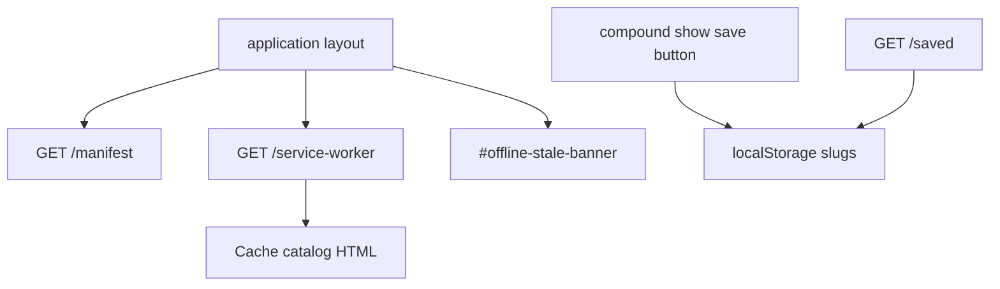

# PWA and device-local saves - Plan

## Goal Capsule

- **Objective:** Visitors on mobile data can install the catalog, read cached compound and provider pages offline, and save compounds on this device with no account.
- **Authority:** `docs/PRD.md` F-15 and F-16, `docs/EPICS.md` EP-06, GitHub `#56` `#65` `#67` `#69` `#71` `#73` `#75`. Compose with Rails 8 native PWA (`dte-pwa`), not a hand-rolled worker from scratch.
- **In scope:** Manifest, service worker routes, offline cache of compound and provider pages, stale banner, device-local save list, keep web push off.
- **Out of scope:** Synced saves (EP-09). Native iOS or Android (EP-09). Push alerts. Saved stacks. Server table for saves. Uncommenting `bcrypt`.
- **Stop when:** The app is installable. Offline browse of compound and provider pages shows a stale banner. Save works without an account. Clearing site data loses the list. Browse still works with no account.
- **Execution profile:** Enable Rails 8 PWA stubs that already exist. Add one Stimulus controller for save and one for the offline banner.

---

## Product Contract

### Summary

Rails 8 already ships `app/views/pwa/manifest.json.erb` and `app/views/pwa/service-worker.js`. Routes are not enabled. The worker file is only commented push sample. The manifest still says red theme and a placeholder name. This plan turns those stubs on for install and offline catalog browse, and adds a device-local saved list.

### Problem Frame

Mobile data in South Africa drops. People will open a compound page in a queue. An empty heart with no local save is theatre. Accounts can wait until the catalog is trusted.

### Requirements

**Install (F-15, `#65` `#75`)**

- R1. Enable the installable home-screen app using the Rails 8 manifest and service-worker routes.
- R2. Leave web push commented and off. Do not register a push listener.

**Offline (F-15, `#67` `#69`)**

- R3. Cache compound and provider pages for offline browse.
- R4. When the network is down, show a banner that the copy is cached and may be stale.

**Saves (F-16, `#71` `#73`)**

- R5. Save and unsave compounds on this device. The list survives refresh.
- R6. Clearing site data loses the list. Browse still works with no account. No server table.

### Actors

- A1. Visitor on a phone with flaky data.
- A2. Visitor who wants a short list of compounds on this device only.

### Key Flows

- F1. Add to home screen from the browser install prompt
  - **Outcome:** Standalone display. `start_url` is `/`.
- F2. Open a previously visited compound page with the network off
  - **Outcome:** Page renders from cache. `#offline-stale-banner` is visible.
- F3. Tap save on `/compounds/bpc-157`, refresh, open `/saved`
  - **Outcome:** BPC-157 is listed. No login.
- F4. Clear site data, then open `/compounds` and `/saved`
  - **Outcome:** Catalog still loads when online. Saved list is empty.

### Acceptance Examples

- AE1. Covers R1. GET `/manifest.json` (or the Rails 8 PWA path) returns JSON with `display: standalone` and a non-placeholder name.
- AE2. Covers R4. Offline visit of a cached compound page shows `#offline-stale-banner`.
- AE3. Covers R5, R6. Save then reload still shows the item. After storage clear, `#saved-index-empty` is present and `#compound-index` still works when online.

### Scope Boundaries

- **In:** Manifest fill, SW cache for `/compounds*` and `/providers*`, offline banner, localStorage saves, `/saved` page.
- **Deferred for later:** Synced saves and accounts (EP-09). Saved stacks (with EP-08).
- **Outside this product's identity:** Web push. Offline accounts. Native shells.

---

## Planning Contract

### Key Technical Decisions

- KTD1. **Use Rails 8 native PWA routes.** Add:
  - `get "manifest" => "rails/pwa#manifest", as: :pwa_manifest`
  - `get "service-worker" => "rails/pwa#service_worker", as: :pwa_service_worker`
  In the layout head: `tag.link rel: "manifest", href: pwa_manifest_path(format: :json)`. Register `/service-worker` from importmap JS with `scope: "/"`. Do not add Workbox or a second worker library.
- KTD2. **Fill the existing manifest.** Replace placeholder `PeptidesResearchSouthAfrica` and `theme_color: red`. `name` uses `t("app.name")`. `short_name` uses locale `app.short_name` set to `SA catalog` (10 characters, not a public brand candidate). Theme colours from the stone layout (`#fafaf9` / `#1c1917`). Keep `display: standalone` and existing `/icon.png`. Do not invent PeptideSA or similar.
- KTD3. **Network-first HTML for catalog pages, including Turbo Drive fetches.** Cache same-origin GET HTML under `/compounds`, `/providers`, and `/saved` whether the request is a full navigation or a Turbo fetch (`Accept` includes `text/html`). Try network, cache the successful HTML, fall back to cache. Runtime-cache digested CSS and JS as the browser requests them (Propshaft fingerprints). Do not hardcode undigested `/assets/*` paths. Precache `/` and `/icon.png` only as fixed URLs. Uncached offline URLs may fail; only previously cached catalog pages must render. Do not cache POST. Do not enable the commented push handlers.
- KTD4. **Stale banner is a client online signal, not a cache timestamp clock.** Stimulus `offline_banner_controller` listens to `window` `offline` / `online`. When `navigator.onLine` is false, show `#offline-stale-banner` with locale `pwa.stale`. When online, hide it. Do not pretend to know the cache age.
- KTD5. **Saves live in `localStorage` only.** Key `catalog.savedCompoundSlugs` as a JSON array of slugs. Stimulus `saved_compounds_controller` on the compound show button and on `/saved`. No `SavedCompound` model. No cookie of the list.
- KTD6. **`/saved` is a public GET page.** Route: `get "saved" => "saved_compounds#index", as: :saved`. The server renders the empty shell. Stimulus reads `catalog.savedCompoundSlugs` and paints `#saved-index` as links to `/compounds/:slug` immediately. Do not fetch compound pages to build the list. Optional online check may drop unknown slugs later; it must not block first paint. No account gate.
- KTD7. **bcrypt stays commented.** F-16 forbids a password stack. Magic link is EP-09.

### Assumptions

- Playwright scaffold from plan 001 exists when e2e specs land. If missing, copy that unit rather than a second config.
- Home and static assets are small enough to precache. Do not cache every product URL.
- Install prompt UI: browser chrome is enough for v1. Do not add a custom install button unless Chrome withholds the native prompt on this origin.

### High-Level Technical Design

### Sequencing

U1 routes and manifest, U2 service worker cache, U3 offline banner, U4 device saves, U5 tests.

---

## Implementation Units

### U1. Enable Rails 8 PWA routes and fill the manifest

- **Goal:** The app is a valid installable web app shell.
- **Requirements:** R1
- **Dependencies:** none
- **Files:**
  - modify: `config/routes.rb`
  - modify: `app/views/pwa/manifest.json.erb`
  - modify: `app/views/layouts/application.html.erb`
  - modify: `config/locales/en.yml`
- **Approach:** Add the Rails 8 `rails/pwa#manifest` and `rails/pwa#service_worker` routes with stable names. Link `rel="manifest"`. Manifest `name` uses the locale app name. `short_name` is a short catalog label, not a new public brand. Theme colours match the stone layout. Keep push out.
- **Patterns to follow:** Rails 8 PWA generator files already in `app/views/pwa/`.
- **Test scenarios:**
  - Covers AE1. GET the manifest path returns 200 JSON, `display` is `standalone`, `theme_color` is not `red`.
  - Layout includes the manifest link.
- **Verification:** Integration test on the manifest. App still boots.

### U2. Cache compound and provider pages; keep push off

- **Goal:** Offline read of catalog pages. No push.
- **Requirements:** R2, R3
- **Dependencies:** U1
- **Files:**
  - modify: `app/views/pwa/service-worker.js`
  - modify: `app/javascript/application.js` (register the worker here; do not add a separate unpinned file)
- **Approach:** `if (navigator.serviceWorker) { navigator.serviceWorker.register("/service-worker", { scope: "/" }) }`. Worker: `install` precaches `/` and `/icon.png` only. `fetch` network-first for GET HTML under `/compounds`, `/providers`, and `/saved` (Turbo and navigations). Runtime cache same-origin GET stylesheet and script responses after they succeed. Leave push and notificationclick commented or delete them if they would run. Never `respondWith` on non-GET.
- **Patterns to follow:** Rails 8 service worker template. `dte-pwa` "do not swallow downloads".
- **Test scenarios:**
  - Service worker URL returns JavaScript and does not contain an active `push` listener.
  - A comment or test notes that push stays off (`#75`).
- **Verification:** GET service-worker path. Grep confirms no live `addEventListener("push"`.

### U3. Cached-and-stale banner

- **Goal:** Offline visitors see that the copy may be old.
- **Requirements:** R4
- **Dependencies:** U1
- **Files:**
  - create: `app/javascript/controllers/offline_banner_controller.js`
  - modify: `app/views/layouts/application.html.erb`
  - modify: `config/locales/en.yml`
- **Approach:** Hidden by default. `id="offline-stale-banner"` `role="status"`. Show when `offline` fires or `navigator.onLine === false` on connect. Hide on `online`. Copy from `pwa.stale`. No JavaScript required for the rest of browse.
- **Patterns to follow:** Existing Stimulus `hello_controller.js` registration via `index.js`.
- **Test scenarios:**
  - Covers AE2. Banner id exists in the layout. A controller test or Playwright offline context shows it when offline.
  - Banner is hidden on a normal online visit.
- **Verification:** Playwright or a Stimulus unit. Integration asserts the element exists.

### U4. Device-local save and unsave

- **Goal:** Save compounds on this device without an account.
- **Requirements:** R5, R6
- **Dependencies:** none
- **Files:**
  - create: `app/javascript/controllers/saved_compounds_controller.js`
  - create: `app/controllers/saved_compounds_controller.rb`
  - create: `app/views/saved_compounds/index.html.erb`
  - modify: `app/views/compounds/show.html.erb`
  - modify: `config/routes.rb`
  - modify: `app/views/layouts/application.html.erb` (nav link `#site-nav-saved`)
  - modify: `config/locales/en.yml`
- **Approach:** Add `get "saved" => "saved_compounds#index", as: :saved`. Button `#compound-save-<slug>` with locale labels for save and unsave, `aria-pressed` true when saved. Toggle slug in localStorage. No authentication. Empty state `#saved-index-empty`. List `#saved-index` with links `#saved-link-<slug>` painted from slugs (no fetch required). Server does not persist the list. Do not add a `saved_compounds` table.
- **Patterns to follow:** Compound index card ids. Locale-only English.
- **Test scenarios:**
  - Covers AE3. Integration: GET `/saved` is 200 with no login and shows empty state when storage is empty.
  - Compound show includes the save button id.
  - Playwright: click save, reload, `/saved` lists BPC-157. Clear storage, list empty, `/compounds` still 200.
- **Verification:** No migration. `bin/rails test` green. Browse never redirects to login.

### U5. Playwright for install shell, offline banner, and save

- **Goal:** Browser proof of F-15 and F-16 using ids only.
- **Requirements:** R1, R4, R5, R6
- **Dependencies:** U1, U3, U4. Playwright scaffold from plan 001 U4.
- **Files:**
  - create: `e2e/pwa-saves.spec.ts`
- **Approach:** Assert manifest link. Visit a compound while online, go offline, click a compound link from the index (Turbo). Assert `#offline-stale-banner` on a cached show. Uncached offline URLs may fail. Save flow on `#compound-save-bpc-157` and `#saved-index`.
- **Patterns to follow:** `e2e/compound-legal-flags.spec.ts` if present.
- **Test scenarios:**
  - Manifest link present.
  - Offline banner id when the browser is offline.
  - Save survives reload. Clear storage empties `/saved`.
- **Verification:** `npx playwright test e2e/pwa-saves.spec.ts`. Do not add this to `bin/ci` in this plan.

---

## Verification Contract

| Gate | Command | Proves |
| --- | --- | --- |
| Manifest and saved page | `bin/rails test test/integration/catalog_browse_test.rb` (or a new pwa integration file) | Routes and empty saved list |
| Full suite | `bin/rails test` | No login wall on catalog |
| Lint | `bin/rubocop` | Style |
| Browser | `npx playwright test e2e/pwa-saves.spec.ts` | Offline banner and save |
| Manual | Chrome Application panel: Manifest parsed, worker activated | Installable, or note unmeasured if no browser |

---

## Definition of Done

- `#56` stories `#65` `#67` `#69` `#71` `#73` `#75` are covered.
- Push stays off. No server save table. `bcrypt` stays commented.
- Disclaimer still renders on catalog pages when offline if those pages were cached.
- Abandoned worker experiments are not left in the diff.

---

## Risks and Dependencies

- **Better after EP-05** so cached browse includes filters. Not required. Cache whatever HTML the live index returns.
- **Service worker tests are awkward in Minitest.** Prefer Playwright for offline. Keep Minitest on routes and markup.
- **Depends on:** Phase 1 compound and provider pages. Independent of accounts.
