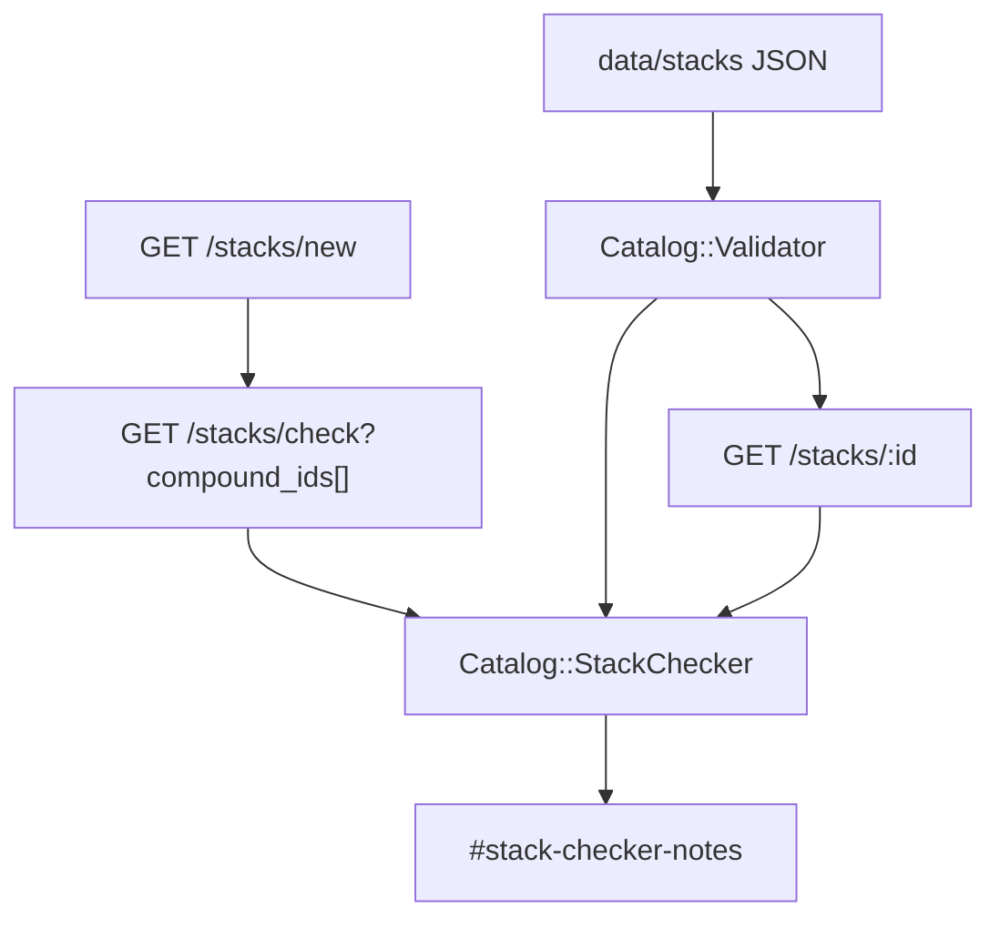

# Stack checker, named stacks, and pair notes - Plan

## Goal Capsule

- **Objective:** A researcher picks two or more catalog compounds and sees catalog-derived notes. Named stacks are records of a convention. Pair notes appear only inside the checker.
- **Authority:** `docs/PRD.md` F-18, F-19, F-21, `docs/EPICS.md` EP-08 Phase 4, GitHub `#60` `#66` `#68` `#70` `#72` `#74`.
- **In scope:** Checker from class, routes, pair notes, and WADA rollup. Named stack JSON, importer, pages. Publish block when the checker fails. Disclaimer. No "safe to combine".
- **Out of scope:** Arithmetic helper (F-20, `#76` `#77`, separate plan). User-saved stacks in JSON. Drug-interaction engine against other medicines. "Stack for fat loss" generator.
- **Stop when:** Checker notes are sourced and catalog-derived. Named stacks are conventions with legal and WADA rollups. Pair notes have no second UI. Disclaimer is above the fold on stack views.
- **Execution profile:** New `Catalog::StackChecker` in `lib/catalog`. New Stack records imported from `data/stacks/`. Do not ship the checker on an empty compound catalog (Phase 1 compounds already exist).

---

## Product Contract

### Summary

Compound JSON already has `class`, `routes_studied`, `stack_pair_notes`, and `wada`. Stack schema exists. `data/stacks/` is empty. There is no checker UI. This plan adds the checker first, then named stack files that must pass it.

### Problem Frame

Community names and pairings exist. A checker on invented chemistry is a toy. Saying "safe to combine" would be medical advice. Pair notes on a second screen would look like a drug-interaction engine.

### Requirements

**Checker (F-18, `#66` `#68`)**

- R1. The checker takes two or more catalog compound ids and returns: same class twice, route clash, known pair notes, WADA rollup.
- R2. Repeat the site disclaimer on stack views. Never say "safe to combine". Do not ingest the person's other medicines.

**Named stacks (F-19, `#70` `#72`)**

- R3. Named stacks are catalog records of a convention (`origin` `vendor_named` or `commonly_reported`), with nickname search (example: Wolverine, BPC-157 + TB-500).
- R4. Do not publish a named stack that fails the checker. Fail means invalid data: unknown compound ids or fewer than two members. Class overlap, route notes, and WADA flags are warnings shown on the page. They do not block the file. Roll up legal and WADA flags from members.

**Pair notes (F-21, `#74`)**

- R5. Pair notes appear only inside the checker. Each note has a source. No second pair-notes page.

### Actors

- A1. Researcher comparing two catalog compounds.
- A2. Visitor who typed a community nickname.

### Key Flows

- F1. Open `/stacks/new` (or `/stacks/check`), pick BPC-157 and TB-500, submit
  - **Outcome:** Notes include the stored `common_pair` note, class overlap if both are `healing`, and WADA prohibited rollup. Copy does not say safe.
- F2. Open a published named stack
  - **Outcome:** Members, disclaimer, checker notes, WADA rollup. No buy path.
- F3. Import a stack JSON that fails the checker
  - **Outcome:** `catalog:check` fails. File does not appear on the public index.

### Acceptance Examples

- AE1. Covers R1, R5. Given BPC-157 `stack_pair_notes` for `tb-500`, the checker result includes that note only in `#stack-checker-notes`, not on `/compounds/bpc-157` as a new section.
- AE2. Covers R2. Stack page includes `#catalog-disclaimer` and has no string "safe to combine".
- AE3. Covers R4. A fixture stack whose members fail the checker is rejected by `Catalog::Validator` or importer.

### Scope Boundaries

- **In:** Checker page, stack model, JSON import, one or two named stacks that pass (or an honest empty stacks index until a passing convention exists).
- **Deferred:** F-20 arithmetic helper. User origin stacks after accounts.
- **Outside this product's identity:** Personal recommendation. Weight-based stack. Warfarin/SSRI interaction check.

---

## Planning Contract

### Key Technical Decisions

- KTD1. **`Catalog::StackChecker` in `lib/catalog/stack_checker.rb`.** Input: array of Compound records (min 2). Output: a simple struct of notes (`class_overlap`, `route_clash`, `pair_notes`, `wada`). No ActiveRecord callbacks. No "safe" boolean.
- KTD2. **Class overlap** is two or more members sharing the same primary `classification`. **Route note** (not a pharmacology clash): emit when at least one member lists `injectable_subq` or `injectable_im` in `routes_studied` and at least one other member lists neither. Do not invent drug-interaction meaning.
- KTD3. **WADA rollup:** if any member `payload.wada.prohibited` is true, the stack is prohibited for tested athletes. If any member has `wada: null`, rollup is unknown. Show SAIDS copy from EP-04 locale if that partial exists, else a stack-specific legal line.
- KTD4. **Pair notes** are the union of each member's `stack_pair_notes` where `other_id` is also in the picked set. Require `sources` on the note when present; if a live note lacks sources (BPC-157's current pair note has no sources key), the checker still shows the note and a "source not on file" line rather than hiding it. Tightening JSON is allowed in the same epic if the schema already permits `sources`.
- KTD5. **Named stacks import like compounds.** Add `stacks` to `Catalog::RECORD_DIRS`. New `Stack` model: slug, name, payload, last_reviewed_at. Skip `origin: user_saved` on the public index. Public index only `vendor_named` and `commonly_reported`.
- KTD6. **Publish gate in the validator.** After product refs, load stack files. Every `compound_ids` member must exist. Run `StackChecker` on those compounds. Fail `catalog:check` when the checker returns a `blocking` failure. Define blocking as: missing members. Class overlap, route notes, and WADA prohibited are **warnings that still publish**, with the rollup shown. "Fails the checker" in F-19 means **invalid data** (unknown ids, fewer than two members), not "has a WADA flag". A WADA-prohibited convention may exist; it must show the rollup. Do not hide Wolverine-style pairs only because WADA flags members.
- KTD7. **Routes:** `get "stacks/check", to: "stacks#check", as: :stack_check` plus `resources :stacks, only: %i[index show new]`. Do not use POST `create` for the checker. The result URL with `compound_ids[]` is shareable. `new` is the picker.
- KTD8. **Do not add pair notes to compound show.** Compound pages already exist. This plan must not add a pair-notes section there.

### Assumptions

- Starter compounds exist. BPC-157 already notes TB-500 as `common_pair`.
- No named stack file exists yet. U4 may add `data/stacks/bpc-157-tb-500.json` (or a nickname) only after the checker runs on it. If the curator rejects the nickname, ship an empty honest stacks index.
- Arithmetic helper is a different plan. Stack pages do not link a dose calculator.

### High-Level Technical Design

### Sequencing

U1 checker object, U2 checker UI, U3 stack import and validator gate, U4 named stack records and pages, U5 tests.

---

## Implementation Units

### U1. Stack checker object

- **Goal:** Catalog-derived notes from two or more compounds, with no safe flag.
- **Requirements:** R1, R5
- **Dependencies:** none
- **Files:**
  - create: `lib/catalog/stack_checker.rb`
  - create: `test/models/catalog_stack_checker_test.rb`
- **Approach:** `Catalog::StackChecker.new(compounds).result` returns class overlap, route notes, pair notes (only pairs both in the set), WADA rollup. Raise or return an error struct when fewer than two compounds. Never include other-medicine prompts.
- **Patterns to follow:** `lib/catalog/validator.rb` style. Payload reads for `wada` and `stack_pair_notes`.
- **Test scenarios:**
  - Covers AE1. BPC-157 + TB-500 includes the stored common_pair note.
  - Two compounds of the same `classification` emit class overlap.
  - Any prohibited WADA member sets rollup prohibited.
  - One compound only is an error, not a pass.
  - Result object has no `safe` attribute.
- **Verification:** Model tests without views.

### U2. Checker UI with disclaimer

- **Goal:** Visitors pick compounds and see notes. Copy never says safe to combine.
- **Requirements:** R1, R2, R5
- **Dependencies:** U1
- **Files:**
  - create: `app/controllers/stacks_controller.rb`
  - create: `app/views/stacks/new.html.erb`
  - create: `app/views/stacks/check.html.erb`
  - modify: `config/routes.rb`
  - modify: `app/views/layouts/application.html.erb` (nav `#site-nav-stacks`)
  - modify: `config/locales/en.yml`
- **Approach:** Picker is a GET form of compound checkboxes or a multi-select, ids `#stack-picker` and `#stack-picker-submit`. Result `#stack-checker`, `#stack-checker-notes`, `#stack-wada-rollup`. Render `catalog-disclaimer` first. Pair notes only in `#stack-checker-notes` with `#stack-pair-note-<other_id>`. Locale must not contain "safe to combine".
- **Patterns to follow:** Compound index GET filters. Disclaimer partial.
- **Test scenarios:**
  - Covers AE2. Check page includes disclaimer. Response body does not include "safe to combine".
  - GET with bpc-157 and tb-500 shows the pair note id.
  - GET with one id shows an honest error `#stack-checker-too-few`.
- **Verification:** Integration test. RuboCop clean.

### U3. Import stacks and fail the merge check on bad files

- **Goal:** Stack JSON loads. Unknown members cannot merge.
- **Requirements:** R4
- **Dependencies:** U1
- **Files:**
  - modify: `lib/catalog.rb`
  - modify: `lib/catalog/importer.rb`
  - modify: `lib/catalog/validator.rb`
  - create: `app/models/stack.rb`
  - create: `db/migrate/*_create_stacks.rb`
  - create: `data/_templates/stack.json`
  - modify: `test/models/catalog_validator_test.rb`
  - modify: `test/models/catalog_importer_test.rb`
- **Approach:** Add `"stack" => "stacks"` to `Catalog::RECORD_DIRS`. An empty `data/stacks/` directory is valid. Validate each stack file: `compound_ids` length >= 2 and every id has a compound file. Skip `origin: user_saved` like rumour. Do not fail the merge check for WADA or class overlap. Missing members fail the check.
- **Patterns to follow:** Compound import and product ref checks.
- **Test scenarios:**
  - Covers AE3. Stack pointing at a missing compound fails validator.
  - Stack with one member fails.
  - Valid stack with two live ids passes even if WADA rollup is prohibited.
- **Verification:** `bin/rails catalog:check` still green on live data (empty stacks folder is ok).

### U4. Named stack pages and optional first convention record

- **Goal:** Nickname search reaches a convention record, not a personal recommendation.
- **Requirements:** R3, R4
- **Dependencies:** U2, U3
- **Files:**
  - create: `app/views/stacks/index.html.erb`
  - create: `app/views/stacks/show.html.erb`
  - optional create: `data/stacks/*.json` only after checker notes are acceptable
  - modify: `test/integration/catalog_browse_test.rb`
- **Approach:** Index `#stack-index` with honest empty state `#stack-index-empty`. Show page lists members as compound links, runs the checker, shows WADA rollup. Title copy: "Catalog record of a named convention". Aliases searchable once EP-05 search exists; until then, list aliases on the page. If no JSON is ready, ship empty index and do not invent a Wolverine file.
- **Patterns to follow:** Provider index empty state. Compound show disclaimer placement.
- **Test scenarios:**
  - Empty stacks folder: index 200 with `#stack-index-empty`.
  - If a file is added, show includes disclaimer, members, and `#stack-checker-notes`.
- **Verification:** Live `catalog:check` green. No buy button.

### U5. Playwright for checker and disclaimer

- **Goal:** Browser proof of F-18 and F-21 ids.
- **Requirements:** R1, R2, R5
- **Dependencies:** U2. Playwright scaffold from plan 001.
- **Files:**
  - create: `e2e/stack-checker.spec.ts`
- **Approach:** Open picker, select bpc-157 and tb-500, submit, assert `#stack-checker-notes` and `#catalog-disclaimer`. Assert no pair-notes section on `/compounds/bpc-157`.
- **Test scenarios:**
  - Checker result ids exist.
  - Compound show does not grow a `#compound-pair-notes` section.
- **Verification:** Playwright plus full Minitest.

---

## Verification Contract

| Gate | Command | Proves |
| --- | --- | --- |
| Checker | `bin/rails test test/models/catalog_stack_checker_test.rb` | Notes and WADA rollup |
| Validator | `bin/rails test test/models/catalog_validator_test.rb` | Bad stack files fail |
| Pages | `bin/rails test test/integration/catalog_browse_test.rb` | Disclaimer, empty index |
| Merge check | `bin/rails catalog:check` | Live catalog including empty stacks |
| Browser | `npx playwright test e2e/stack-checker.spec.ts` | Pair notes only in checker |

---

## Definition of Done

- `#60` Phase 4 stories `#66` `#68` `#70` `#72` `#74` are covered.
- `#76` `#77` are not in this plan.
- No "safe to combine". No second pair-notes UI. No other-medicine form.
- JSON remains the source of truth for named stacks.

---

## Risks and Dependencies

- **KTD6 publish meaning.** Product text "fails the checker" is easy to read as "has any note". This plan treats missing members as the merge failure, and treats WADA or class overlap as shown warnings. If the curator wants class-overlap to block publish, say so before U4 adds JSON.
- **Depends on:** EP-02 compounds, EP-04 WADA payload. Search of nicknames is better after EP-05 but list+aliases is enough.
