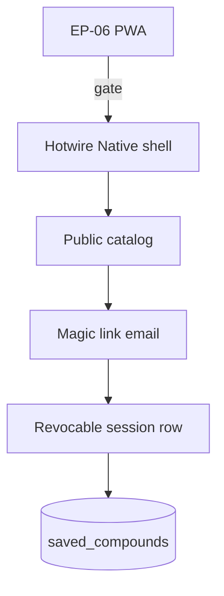

# Accounts and native wrapper - Plan

## Goal Capsule

- **Objective:** A returning researcher signs in with a magic link and sees the same saved compounds (and stacks, if EP-08 exists) on another device. A thin native shell waits until the PWA is real.
- **Authority:** `docs/PRD.md` F-22 and F-23, `docs/EPICS.md` EP-09, GitHub `#50` `#52` `#53` `#54` `#55` `#57`.
- **In scope:** Magic-link sign-in, logged-out browse, synced saves, social login off, native wrapper gated on EP-06, wrapper uses the same catalog and adds no shop or clinic features.
- **Out of scope:** Password login unless later chosen. Selling the list. Social graphs. Push spam. Checkout. Starting iOS or Android while the service worker is still a no-op.
- **Stop when:** Magic link restores saves on a second device. Logged-out browse still works. Native work has not started while offline install is incomplete.
- **Execution profile:** Phase 5. Depends on EP-06 device-local saves (plan 006) and is more useful after EP-08 stack UI. Do not enable `bcrypt` for user passwords. Magic link does not need that gem.

---

## Product Contract

### Summary

Device-local saves (EP-06) are enough until the catalog is trusted. This plan adds optional identity so the same list appears on a second device. The JSON catalog stays the research source of truth. Native wrapping is a thin shell around that same catalog, only after installable offline browse works.

### Problem Frame

A native app before offline browse works is a fake shell. Requiring an account to read the catalog would hide the public research pages.

### Requirements

- R1. Add magic-link sign-in. Browse still works logged out (`#52`).
- R2. Sync saved compounds and stacks across devices. Do not sell the list (`#53`).
- R3. Keep social login optional-off. Do not require a profile to read the catalog (`#54`).
- R4. Start a thin native wrapper only after EP-06 is installable and offline (`#55`).
- R5. Confirm the wrapper uses the same catalog and adds no checkout, push spam, or clinic features (`#57`).

### Actors

- A1. Logged-out visitor (default).
- A2. Returning researcher with an email inbox.

### Key Flows

- F1. Open `/compounds` with no cookie
  - **Outcome:** Catalog 200. No login wall.
- F2. Request a magic link, open it on a second browser, see `/saved`
  - **Outcome:** The same server-side saved compounds appear. Device-local list is not the source of truth once signed in.
- F3. Native wrapper attempt while PWA routes are still off
  - **Outcome:** This plan forbids starting the native apps. U4 is skipped until plan 006 is done.

### Acceptance Examples

- AE1. Covers R1, R3. GET `/compounds` without a session is 200. No OAuth buttons.
- AE2. Covers R2. After magic-link login, saved slugs persist in PostgreSQL and appear on `/saved`.
- AE3. Covers R4, R5. Native unit is gated; checklist forbids checkout, push, clinic booking in the shell.

### Scope Boundaries

- **In:** Email magic link, session cookie, `saved_compound` rows (and `saved_stack` if stacks exist), public catalog remains unauthenticated.
- **Deferred:** Passwords. Social login. Native store submission.
- **Outside this product's identity:** Follow a researcher. Push spam. Clinic booking. Shop.

---

## Planning Contract

### Key Technical Decisions

- KTD1. **Catalog controllers stay public.** Do not add a global `before_action :authenticate`. If an `Authenticate` concern is introduced, catalog, home, stacks, and arithmetic must `allow_unauthenticated` or sit outside the lock. Least astonishment: reading the catalog never requires email.
- KTD2. **Magic link, not passwords.** `User` has `email` unique. `generates_token_for :magic_link` (Rails 7.1+) or a hashed token table. Mailer sends one-time URL. Do not uncomment `gem "bcrypt"` for user passwords. Session can be an encrypted cookie holding `user_id` plus a random session id stored as a SHA digest without bcrypt, or a signed cookie. Prefer a `sessions` table with a digest so logout is revocable.
- KTD3. **Do not copy the password-based rails-token-auth templates wholesale.** That skill assumes `has_secure_password` on the user. This product forbids passwords in v1. Reuse only the ideas: hashed session token, encrypted cookie, real logout destroys the row. Do not add OAuth gems.
- KTD4. **Sync model.** `saved_compounds` table: `user_id`, `compound_id`, unique pair. Optional `saved_stacks` after EP-08. On login, do not silently clobber: if localStorage has slugs the server lacks, offer a one-time merge on the saved page (`#saved-merge`). Document that clearing the browser does not delete the server list once signed in.
- KTD5. **Do not sell the list.** No export-to-advertisers. No public profile of saves. robots-facing pages do not list another user's saves.
- KTD6. **Native wrapper is a later unit with a hard gate.** U4 may create Hotwire Native iOS/Android shells only after: PWA routes live, service worker caches catalog pages, stale banner exists (plan 006). The wrapper loads the same origin. No native checkout, no push permission prompts, no clinic booking screen. If plan 006 is not on `main`, skip U4 entirely and leave `#55` `#57` open.

### Assumptions

- Action Mailer in development can use letter_opener or a logged link. Production mail is out of band for this plan (record as an operational note, not a blocker for the code shape).
- Device-local Stimulus saves from plan 006 remain the logged-out path.

### High-Level Technical Design

### Sequencing

U1 user and magic link, U2 public browse still open, U3 synced saves, U4 native only after 006.

---

## Implementation Units

### U1. Magic-link sign-in

- **Goal:** Email in, one-time link, signed-in session. No password.
- **Requirements:** R1, R3
- **Dependencies:** none
- **Files:**
  - create: `app/models/user.rb`
  - create: `app/models/session.rb` (name may be `AppSession`)
  - create: `db/migrate/*_create_users_and_sessions.rb`
  - create: `app/controllers/sessions_controller.rb`
  - create: `app/mailers/magic_link_mailer.rb`
  - create: `app/views/sessions/new.html.erb`
  - modify: `config/routes.rb`
  - modify: `config/locales/en.yml`
  - modify: `Gemfile` only if a mail preview gem is added in development. Do not uncomment bcrypt.
- **Approach:** `GET /login` form `#login-email`. Submit button `#login-submit` may disable while the request is in flight. `POST /login` always renders "check your email" (`#login-check-email`) even when the address is new or unknown (timing-safe, no enumeration). Create the user only on first successful link click, not on the request. Token uses `generates_token_for :magic_link, expires_in: 15.minutes`. Link hits `GET /login/:token`. Invalid or reused token renders `#login-token-invalid` and does not sign in. Logout `DELETE /logout`. Rate-limit `POST /login` per IP (Rails 8 `rate_limit` on the controller, for example 5 requests per minute). No Google/Apple buttons.
- **Patterns to follow:** Rails `generates_token_for`. Public catalog controllers unchanged.
- **Test scenarios:**
  - Covers AE1. Compounds index 200 without session.
  - Unknown and known emails both show the check-email page.
  - Valid token signs in. Reused or expired token shows `#login-token-invalid` and does not sign in.
  - No bcrypt gem required for these tests.
- **Verification:** Integration tests with mailer. Brakeman still green.

### U2. Keep catalog readable logged out

- **Goal:** Home, compounds, providers, stacks, saved empty-state, arithmetic all work without a session.
- **Requirements:** R1, R3
- **Dependencies:** U1
- **Files:**
  - modify: `app/controllers/application_controller.rb` only if a session helper is added
  - modify: `test/integration/catalog_browse_test.rb`
- **Approach:** Session helper may set `Current.user` when a cookie exists. No before_action that redirects visitors to `/login`. Nav may show `#site-nav-login` and `#site-nav-logout` without hiding catalog links.
- **Test scenarios:**
  - Logged-out GET of every public catalog route remains 200.
  - OAuth provider names do not appear in the login view.
- **Verification:** Existing browse tests still pass.

### U3. Sync saved compounds (and stacks if present)

- **Goal:** Signed-in saves live in PostgreSQL and show on another device.
- **Requirements:** R2, R5
- **Dependencies:** U1, plan 006 saved page
- **Files:**
  - create: `db/migrate/*_create_saved_compounds.rb`
  - create: `app/models/saved_compound.rb`
  - modify: `app/controllers/saved_compounds_controller.rb`
  - modify: `app/javascript/controllers/saved_compounds_controller.js` (signed-in path uses form POST, not only localStorage)
  - modify: `config/routes.rb`
  - modify: `config/locales/en.yml`
- **Approach:** When `Current.user` is present, save/unsave is `POST /saved_compounds` and `DELETE /saved_compounds/:compound_id` (or nested under compounds). Only `Current.user` may write their own rows. `/saved` reads the table. On compound show, `#compound-save-<slug>` `aria-pressed` reflects server truth, not only localStorage. JSON catalog is untouched. Do not add analytics that export the list. If localStorage has extras, `#saved-merge` offers accept (`#saved-merge-accept`) and decline (`#saved-merge-decline`). Accept copies slugs into the table once. Decline leaves the server list unchanged and stops prompting. Logged-out users keep localStorage only.
- **Patterns to follow:** Plan 006 `/saved` ids. Compound `to_param` slug.
- **Test scenarios:**
  - Covers AE2. Signed-in POST save, second session GET `/saved` shows the compound.
  - Logged-out save still does not create a User.
  - No endpoint that dumps all users' saves.
- **Verification:** Integration tests. No `data/*.json` writes.

### U4. Thin native wrapper after PWA, same catalog, no extra product

- **Goal:** Native shells wrap the existing site only when EP-06 is installable and offline.
- **Requirements:** R4, R5
- **Dependencies:** Plan 006 done on `main` (manifest + worker + stale banner)
- **Files:**
  - create only if gate passes: native app folders as Hotwire Native clients, plus `docs/native-wrapper.md` checklist
- **Approach:** If plan 006 is not shipped, skip this unit and leave `#55` `#57` open. If it is shipped: Hotwire Native iOS and Android that load the same origin. Path config: catalog screens are the web views. No native checkout, no push registration, no clinic booking. Confirm in `docs/native-wrapper.md` with a checklist matching `#57`.
- **Patterns to follow:** `hotwire-native-path-config` skill when this unit actually starts. Do not invent a second content API.
- **Test scenarios:**
  - Gate: skip when PWA routes are absent (assert in the plan, not a red test).
  - Wrapper checklist exists and forbids checkout, push spam, clinic features.
- **Verification:** Manual on simulators when the unit runs. Do not start Xcode work in the same commit as U1.

---

## Verification Contract

| Gate | Command | Proves |
| --- | --- | --- |
| Browse | `bin/rails test test/integration/catalog_browse_test.rb` | Still public |
| Auth | integration tests for magic link | Token, no enumeration, no bcrypt |
| Saves | integration tests for signed-in `/saved` | Sync table |
| Security | `bin/brakeman` | No surprise auth holes |
| Native | checklist in `docs/native-wrapper.md` | Same catalog, no shop |

---

## Definition of Done

- `#52` `#53` `#54` covered by U1 to U3.
- `#55` `#57` covered by U4 or explicitly left open until plan 006 ships.
- Logged-out catalog still works. Social login off. List not sold.
- `gem "bcrypt"` remains commented unless a later password story is accepted.

---

## Risks and Dependencies

- **Global authenticate is the main surprise risk.** One mistaken `before_action` hides the catalog. Tests on public GET must stay in the same commits as auth.
- **Depends on:** Plan 006 for native and for the saved page. Plan 007 before synced stacks are meaningful. F-20 is not a dependency.
- **Mail in production** is an operations choice (provider, from-address). Code uses Action Mailer; do not block the plan on a vendor pick. Record the from-address as an implementation-time config.
